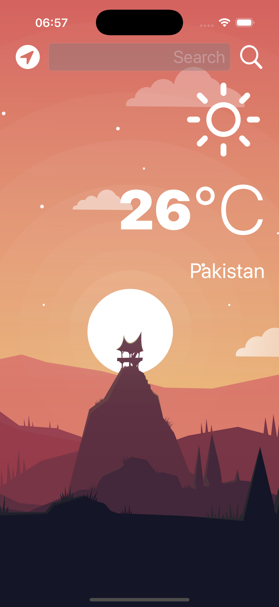

# 🌤️ Clima App

Clima is a simple weather app that provides **real-time weather updates** using a Weather API.  
It shows the temperature, sky condition (☁️ Cloudy, 🌧️ Rainy, ☀️ Sunny, etc.), and city name.

---

## 📱 Screenshots

  
  

---

## 🚀 Features
- Fetch real-time weather data using a **Weather API**
- Display temperature in Celsius
- Show sky condition (Cloudy, Rainy, Sunny, etc.)
- Display city name with weather info
- Simple and clean mobile UI

---

## ⚡ Technologies Used
- Swift (Xcode) 
- REST API (Weather API)
- JSON parsing

